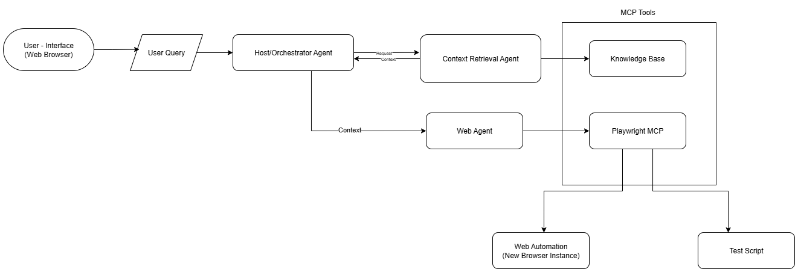
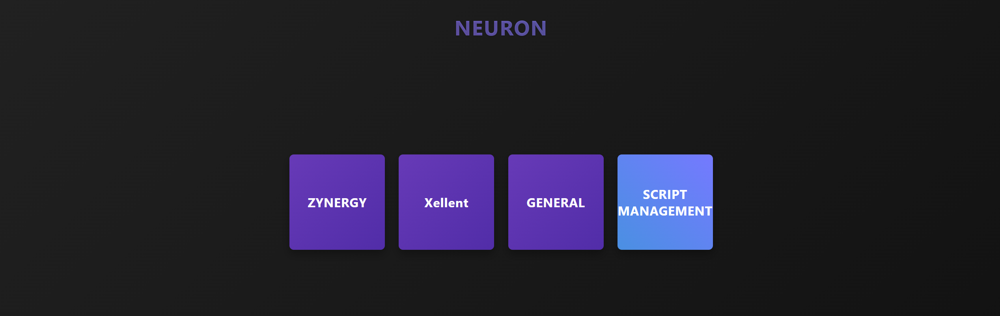
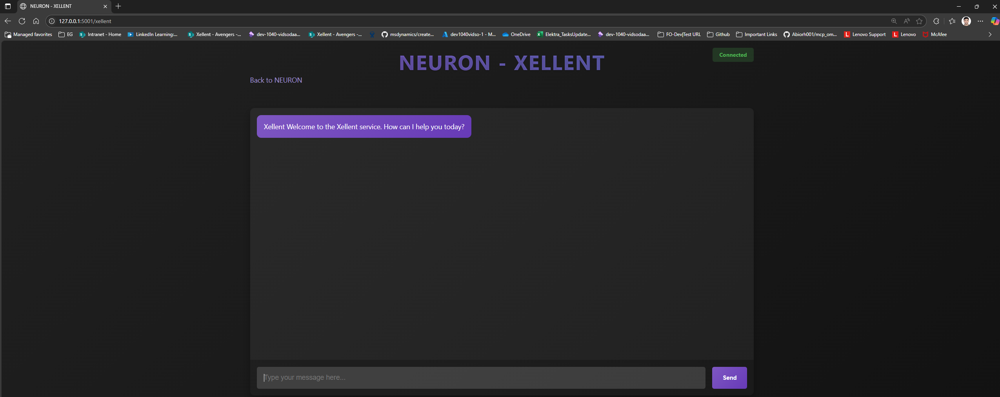
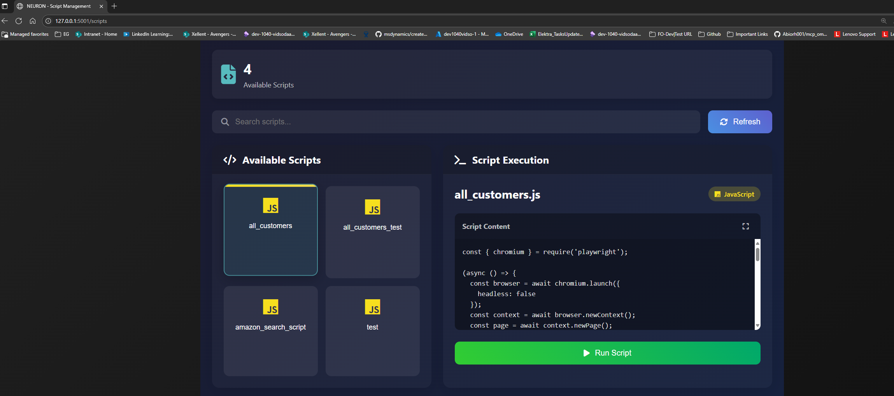

# 🚀 QaAgent

---

## 🛠️ Tech Stack

**Backend**
- Multi-Agent Orchestration (Agent2Agent protocol)
- Retrieval Augmented Generation (RAG) with ChromaDB
- PlaywrightMCPServer for WebAgent tooling
- Orchestrator Agent for task splitting & agent interaction
- FastAPI & Socket.IO for web server and agent interface
- Model: `gemini-2.0-flash`

**Frontend**
- HTML, CSS, JavaScript

---

## ✨ Features

- 📚 Knowledge Base creation using RagPipeline
- 🤖 Website interaction via PlaywrightMCP tools (user query driven)
- 🔍 Context retrieval from Knowledge Base
- 💾 Test script saving for later execution

---

## 🏗️ System Architecture

## 📝 Installation

See detailed steps in [Installation.md](./Installation.md)

---

## 📊 Results

| Dashboard | Chat Interface | Test Script Execution |
|-----------|-----------|-----------|
|  |  |  |

---

## 📂 Execution Results

- Explore execution results in the [`frontend/scripts/`](./frontend/scripts/) directory.

## 📚 References

- [Playwright MCP](https://github.com/microsoft/playwright-mcp)
- [Agent2Agent (A2A) Samples](https://github.com/a2aproject/a2a-samples/)
- [Agent Development Kit (ADK) Samples](https://github.com/google/adk-samples/)
- [A2A Protocol Inspector](https://github.com/a2aproject/a2a-inspector/)
- [See Execution Results under](./frontend/scripts/)

---
